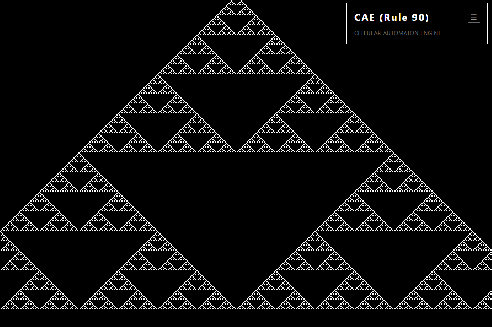
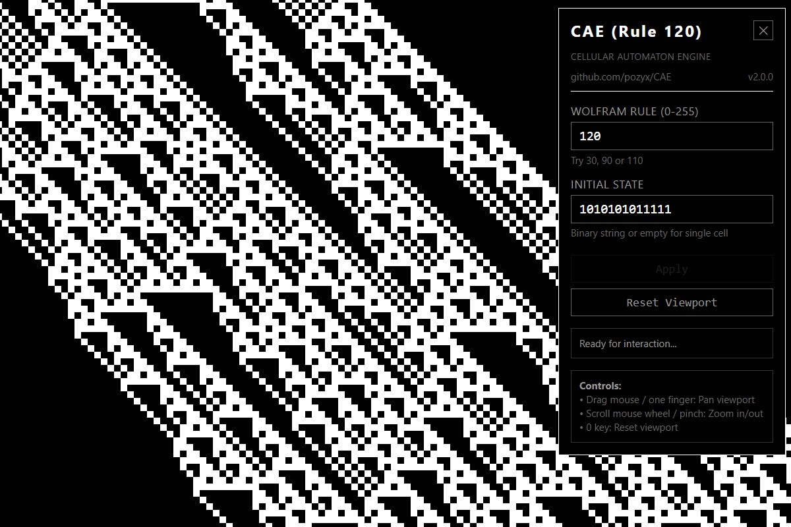

# CAE - Cellular Automaton Engine

A high-performance GPU-accelerated 1D cellular automaton visualizer with interactive viewport controls, built in Rust using WebGPU. Runs natively on desktop and in web browsers via WebAssembly.

**[Try it online →](https://pozyx.github.io/CAE/)**

## Overview

CAE (Cellular Automaton Engine) visualizes [Wolfram's elementary cellular automata](https://en.wikipedia.org/wiki/Elementary_cellular_automaton) rules. It computes and renders thousands of generations in real-time using GPU acceleration, allowing you to explore the fascinating patterns that emerge from simple rules.

The application features an interactive viewport with pan and zoom controls, enabling you to navigate through the generated patterns and explore different regions of the automaton's evolution.

Example of Rule 30 
Example of Rule 90 
Example of Rule 120 with customized initial state 

## Implementations

| Version | Tech Stack | Platforms | Source |
|---------|-----------|-----------|--------|
| **Rust/WebGPU** (original) | Rust, wgpu, winit | Desktop + Web (WASM) | [`src/`](src/) |
| **C++/CUDA** | C++17, CUDA, OpenGL 4.5, GLFW | Desktop (Windows, Linux) | [`cuda/`](cuda/) |

The C++/CUDA version is a native port optimized for NVIDIA GPUs, using CUDA-OpenGL interop for zero-copy rendering. See the [CUDA README](cuda/README.md) for build instructions.

## Features

- **GPU-Accelerated Computation**: All cellular automaton iterations are computed on the GPU using WebGPU compute shaders
- **Zero-Copy Architecture**: Data remains on the GPU throughout the computation pipeline - no CPU readback between iterations
- **Tile-Based Caching**: Intelligent LRU cache system that stores 256×256 cell tiles to avoid redundant computation during navigation
- **Efficient Rendering**: Only computes and renders visible cells based on current viewport
- **Cross-Platform**: Runs as a native desktop application or in web browsers via WebAssembly
- **Interactive Viewport**:
  - Pan by dragging (mouse or touch)
  - Zoom in/out with scroll wheel or pinch
  - Reset to initial view with '0' key
- **Shareable URLs** (web): Share exact views with URL parameters including viewport position and zoom level
- **Fullscreen Support**: Toggle fullscreen mode with F11
- **Flexible Configuration**:
  - Support for all 256 Wolfram elementary CA rules (0-255)
  - Customizable initial states (binary strings or default single-cell)
  - Adjustable window dimensions (desktop)
  - Configurable cache size (desktop)
  - Smooth viewport changes with configurable debounce timing (desktop) - optional

## Quick Start

### Web Version (Instant - No Installation)

Visit **[https://pozyx.github.io/CAE/](https://pozyx.github.io/CAE/)** in a WebGPU-compatible browser (Chrome 113+, Edge 113+, Safari 18+ or Firefox 121+ on Windows).

### Desktop Version

```bash
git clone https://github.com/pozyx/CAE.git
cd CAE
cargo run --release -- --rule 30
```

## Installation

### Prerequisites

- [Rust](https://www.rust-lang.org/tools/install) (2021 edition or later)
- A GPU with WebGPU support (most modern GPUs)
- For web builds: [wasm-pack](https://rustwasm.github.io/wasm-pack/installer/)

### Building Desktop Version

```bash
git clone https://github.com/pozyx/CAE.git
cd CAE
cargo build --release
```

### Building Web Version

```bash
# Install wasm-pack (one-time setup)
cargo install wasm-pack --locked

# Build WebAssembly package
wasm-pack build --target web --out-dir pkg

# Serve locally
python -m http.server 8080
# Open http://localhost:8080 in your browser
```

The build creates a `pkg/` directory with:
- `caelib_bg.wasm` - The WebAssembly binary
- `caelib.js` - JavaScript bindings
- `caelib.d.ts` - TypeScript definitions

## Usage

### Desktop Application

#### Basic Examples

Run with a specific Wolfram rule:
```bash
cargo run --release -- --rule 30
```

Specify a custom initial state:
```bash
cargo run --release -- --rule 110 --initial-state "00100100"
```

Set custom window size:
```bash
cargo run --release -- --rule 90 --width 1280 --height 1024
```

Start in fullscreen mode:
```bash
cargo run --release -- --rule 30 --fullscreen
```

#### Command-Line Options

```
Options:
  -r, --rule <RULE>                    Wolfram CA rule number (0-255)
      --initial-state <INITIAL_STATE>  Initial state as binary string (e.g., "00100") [default: single center cell]
      --width <WIDTH>                  Window width in pixels [default: 1280]
      --height <HEIGHT>                Window height in pixels [default: 960]
      --debounce-ms <DEBOUNCE_MS>          Debounce time before recomputing [default: 0]
      --cache-tiles <CACHE_TILES>          Maximum tiles to cache (0=disable) [default: 64]
      --cache-tile-size <CACHE_TILE_SIZE>  Cache tile size in cells (NxN) [default: 256]
  -f, --fullscreen                         Start in fullscreen mode
  -h, --help                           Print help
```

### Web Application

The web version features an interactive control panel:

**Controls:**
- **Rule**: Select any Wolfram rule (0-255)
- **Initial State**: Customize initial state (binary string or default single-cell)
- **Apply**: Apply settings and restart simulation
- **Reset Viewport**: Return to initial view

**URL Parameters:**

Share specific configurations and views using URL parameters:
- `rule` - Wolfram rule number (e.g., `?rule=110`)
- `initial-state` - Initial state binary string (e.g., `&initial-state=00100`)
- `vx` - Viewport X offset (auto-updated when panning)
- `vy` - Viewport Y offset (auto-updated when panning)
- `vzoom` - Viewport zoom level (cell size in pixels, auto-updated when zooming)

Example: `https://pozyx.github.io/CAE/?rule=110&initial-state=00100&vx=-50.23&vy=100.00&vzoom=20`

### Interactive Controls

- **Drag to pan** (mouse or touch)
- **Scroll wheel or pinch to zoom**
- **0 key**: Reset viewport to initial position (centered, generation 0, zoom 1.0)
- **F11**: Toggle fullscreen mode
- **ESC**: Exit fullscreen or close application (desktop)

### Caching

The tile-based caching system significantly improves performance when navigating the viewport:

```bash
# Default caching (64 tiles, ~16MB GPU memory)
cargo run --release -- --rule 30

# Larger cache for better performance (128 tiles, ~32MB GPU memory)
cargo run --release -- --rule 30 --cache-tiles 128

# Disable caching
cargo run --release -- --rule 30 --cache-tiles 0
```

Each tile is 256×256 cells. The cache uses an LRU (Least Recently Used) eviction strategy, so frequently accessed areas remain cached while unused tiles are automatically evicted when the cache fills up.

## How It Works

### Architecture

CAE uses a GPU-accelerated pipeline with four main components:

1. **Compute Module** (`src/compute.rs`):
   - Implements Wolfram CA rules using WebGPU compute shaders
   - Computes all generations on the GPU in a single dispatch
   - Uses bit manipulation to evaluate the 3-cell neighborhood and apply rules
   - Provides tile-based computation for cache system

2. **Cache Module** (`src/cache.rs`):
   - Manages LRU tile cache with configurable size
   - Stores 256×256 cell tiles indexed by grid coordinates
   - Tracks cache hits/misses and handles eviction

3. **Render Module** (`src/render.rs`):
   - Manages the application window and event loop
   - Handles user input (pan, zoom, resize)
   - Orchestrates viewport changes and triggers recomputation
   - Renders the visible portion of the CA state

4. **Shaders** (`src/shaders/`):
   - `ca_compute.wgsl`: Compute shader that evolves the CA
   - `render.wgsl`: Vertex/fragment shaders for visualization

### Zero-Copy GPU Pipeline

The entire computation and rendering pipeline keeps data on the GPU:

1. **Initialization**: Initial state uploaded to GPU buffer
2. **Computation**: Compute shader iterates through all generations, writing to GPU storage buffer
3. **Rendering**: Render pipeline reads directly from the GPU buffer - no CPU readback

This architecture achieves optimal performance by eliminating expensive GPU↔CPU transfers.

### Viewport System

The viewport system uses world-space coordinates:

- **Pan**: Translates the viewport origin in world space
- **Zoom**: Scales the viewport (affects cell density and visible area)
- **Debouncing**: Viewport changes are optionally debounced to prevent excessive recomputation during continuous pan/zoom operations

When the viewport changes, the engine:
1. Calculates the new visible region in world space
2. Determines required grid dimensions
3. Recomputes the CA for the visible area on the GPU
4. Renders the result with proper scaling and translation

### Tile-Based Caching System

CAE uses a sophisticated tile-based caching system to avoid redundant GPU computation:

**Grid-Based Tiles**:
- The infinite CA space is divided into fixed 256×256 cell tiles
- Each tile is identified by grid coordinates `(tile_x, tile_y)`
- Tiles are independent units that can be computed and cached separately

**How Caching Works**:
1. **Viewport Mapping**: When rendering, the engine determines which tiles overlap the current viewport
2. **Cache Lookup**: Each required tile is checked against the cache using its grid coordinates
3. **Computation**: Missing tiles are computed on the GPU from generation 0 and inserted into the cache
4. **Assembly**: Cached and newly computed tiles are assembled into a single buffer for rendering
5. **LRU Eviction**: When the cache is full, least recently used tiles are evicted

**Performance Benefits**:
- **Small pan/zoom**: Most tiles are already cached → near-instant response
- **Large navigation**: Only tiles entering the viewport need computation
- **Consistent performance**: Cache effectiveness improves as you explore the same regions
- **Memory efficient**: Configurable cache size (default 64 tiles ≈ 16MB GPU memory)

**Cache Characteristics**:
- Each tile: 256×256×4 bytes = 256 KB GPU memory
- Cache hit rate: Typically 70-90% during normal navigation
- Tile computation: Each tile computes from generation 0 (enables future checkpointing)

**Future Improvements**:
For detailed notes on potential caching optimizations and incremental computation approaches, see [CACHING_NOTES.md](CACHING_NOTES.md).

## Browser Compatibility

The web version requires WebGPU support:

- **Chrome/Edge**: Version 113+ (enabled by default) - **Recommended for best performance**
- **Firefox**: Version 121+ (enabled in Windows by default, for other platforms experimental, enable in `about:config`)
- **Safari**: Version 18+ (Technical Preview)

Check browser compatibility at: https://caniuse.com/webgpu

### GPU Selection on Web

**Important limitation**: Browsers make the final decision about which GPU to use, and the `powerPreference` hint is often ignored:

- **Chrome/Edge on Windows**: Currently ignores the high-performance GPU preference ([Chromium bug 369219127](https://issues.chromium.org/issues/369219127)). The browser uses its own heuristics based on canvas size, workload, and power mode.
- **Firefox**: Similar behavior - browser controls GPU selection based on internal heuristics.
- **Desktop version**: Reliably uses the discrete GPU when `--release` mode is used.

**To verify which GPU your browser is using:**
- Chrome/Edge: Visit `chrome://gpu` or `edge://gpu` and look for the WebGPU section
- Firefox: Visit `about:support` and check Graphics → WebGPU Default Adapter

**Workarounds to force discrete GPU:**
- Windows: Use NVIDIA Control Panel or Windows Graphics Settings to set your browser to "High performance" mode
- macOS: Automatic switching usually works based on workload
- Best option: Use the desktop version for guaranteed discrete GPU usage and maximum performance

## Deploying to GitHub Pages

To deploy your own instance:

1. **Build the WebAssembly package:**
   ```bash
   wasm-pack build --target web --out-dir pkg
   ```

2. **Commit the files:**
   ```bash
   git add src/index.html pkg/
   git commit -m "Update web version"
   git push
   ```

3. **Enable GitHub Pages:**
   - Go to your repository settings
   - Navigate to "Pages" section
   - Set source to "Deploy from a branch"
   - Select your branch (e.g., `master` or `main`)
   - Save

4. **Access your app:**
   - Your app will be available at `https://<username>.github.io/<repository>/`
   - For example: `https://pozyx.github.io/CAE/`

### Other Static Hosting Services

The web version can be deployed to any static hosting service:

- **Netlify**: Drag and drop the directory (with `src/index.html` and `pkg/`)
- **Vercel**: Deploy via CLI or GitHub integration
- **Cloudflare Pages**: Connect your repository and deploy
- **AWS S3**: Upload files and configure bucket for static website hosting

## Project Structure

```
CAE/
├── index.html              # Minimal redirect to src/index.html
├── src/                    # Rust/WebGPU source
│   ├── index.html          # Web UI and application entry point
│   ├── shaders/            # WGSL compute and render shaders
│   │   ├── ca_compute.wgsl # Cellular automaton compute shader
│   │   └── render.wgsl     # Rendering vertex/fragment shaders
│   ├── lib.rs              # Shared library code
│   ├── main.rs             # Desktop entry point (CLI)
│   ├── web.rs              # Web entry point (wasm-bindgen exports)
│   ├── render.rs           # Rendering logic (cross-platform)
│   ├── compute.rs          # GPU compute orchestration
│   └── cache.rs            # Tile caching system
├── cuda/                   # C++/CUDA native port (see cuda/README.md)
│   ├── src/                # C++ source files
│   ├── shaders/            # GLSL vertex/fragment shaders
│   ├── external/           # GLAD (OpenGL loader)
│   ├── CMakeLists.txt      # CMake build configuration
│   └── build.ps1           # Windows build script
├── pkg/                    # Generated WASM package (created by wasm-pack)
│   ├── caelib_bg.wasm      # WebAssembly binary
│   ├── caelib.js           # JavaScript bindings
│   └── ...
├── Cargo.toml              # Dependencies with desktop/web features
├── CACHING_NOTES.md        # Technical notes on caching optimizations
└── README.md               # This file
```

### Desktop vs Web

The codebase supports both desktop and web builds using Cargo features:

```bash
# Build desktop version (default)
cargo build --release

# Build web version
wasm-pack build --target web --out-dir pkg
```

**Code Organization**:
- **Shared code** (`src/lib.rs`, `src/render.rs`, `src/compute.rs`, `src/cache.rs`):
  - Works on both desktop and web
  - Uses `#[cfg(target_arch = "wasm32")]` for platform-specific code

- **Desktop-only** (`src/main.rs`):
  - CLI argument parsing with `clap`
  - Desktop window creation

- **Web-only** (`src/web.rs`):
  - WebAssembly exports with `wasm-bindgen`
  - Browser initialization

## Technical Details

### Performance Characteristics

- **Computation**: O(generations × cells) on GPU, massively parallel
- **Memory**: Two GPU buffers (current and next generation)
- **Rendering**: Only visible cells are rendered (viewport culling)

### Dependencies

**Core:**
- `wgpu`: WebGPU implementation for Rust
- `winit`: Cross-platform window creation and event handling
- `bytemuck`: Safe transmutation for GPU data

**Desktop-only:**
- `clap`: Command-line argument parsing
- `pollster`: Async executor for initialization
- `env_logger` / `log`: Logging

**Web-only:**
- `wasm-bindgen`: Rust ↔ JavaScript interop
- `web-sys`: Web API bindings
- `console_error_panic_hook`: Better error messages in browser console
- `web-time`: Cross-platform time support

## Interesting Rules to Try

- **Rule 30**: Chaotic pattern, used in random number generation
- **Rule 90**: Sierpiński triangle fractal
- **Rule 110**: Turing-complete, complex behavior

## Known Limitations

### Web Version (WebAssembly)

- **Fullscreen Mode**: The control overlay is not visible in fullscreen mode due to WebGPU canvas compositor limitations. To access controls in fullscreen, press ESC to exit fullscreen mode first.

## Troubleshooting

### Web Version

**"Failed to load WASM module"**
- Make sure you're serving over HTTP (not `file://`)
- Check that the `pkg/` directory exists and contains `caelib_bg.wasm`
- Check browser console for detailed error messages

**WebGPU not available**
- Verify your browser supports WebGPU
- Check that hardware acceleration is enabled in browser settings
- Try Chrome/Edge 113+ for best compatibility

**Performance issues**
- Check GPU usage in browser dev tools

### Desktop Version

**Build errors**
- Ensure Rust is up to date: `rustup update`
- Make sure you have a GPU with WebGPU support
- Check that all dependencies in `Cargo.toml` are compatible

## Roadmap

- Additional CA variants (totalistic, etc.)
- Incremental computation and checkpointing optimizations (see [CACHING_NOTES.md](CACHING_NOTES.md))

## Development

### Rebuilding After Changes

After modifying Rust code:
```bash
# Desktop
cargo build --release

# Web
wasm-pack build --target web --out-dir pkg
# Refresh your browser to load the new WASM
```

After modifying `src/index.html`:
- Just refresh your browser (no rebuild needed)

This project was developed with the assistance of [Claude Code](https://claude.com/claude-code), Anthropic's AI-powered development tool.

## License

MIT License - see LICENSE file for details

## Acknowledgments

- Stephen Wolfram for his pioneering work on cellular automata
- The Rust and WebGPU communities for excellent tools and documentation
